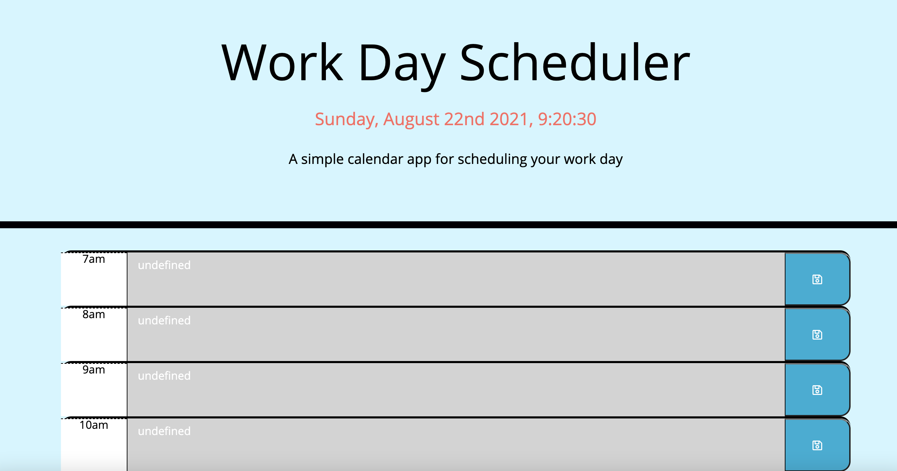

## Project Name : task-organizer
 
 

## Link to the working site
 

    - https://kasdjono.github.io/task-organizer/
 

## This program will organize user's daily tasks
 
 

## The following features have been added to the page:
 

        - When the page is opened the current Day/Time is displayed
        - The page has time blocks for standard business hours
        - Time blocks are colored if it is a past/current/future task 
        - Events can be typed into the time blocks
        - * Save button will save the tasks in local memory
        - * When the page is revisited/refreshed, the task will remain in the time blocks

 

## Screen Shots of Profile Page
 

 
